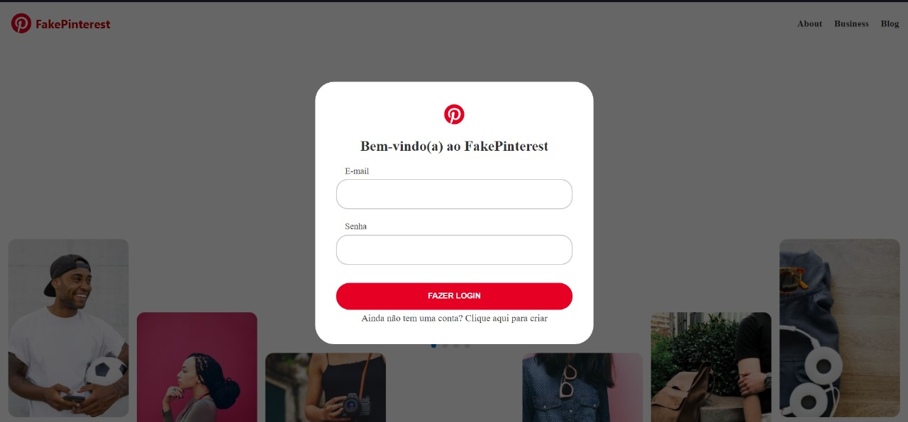
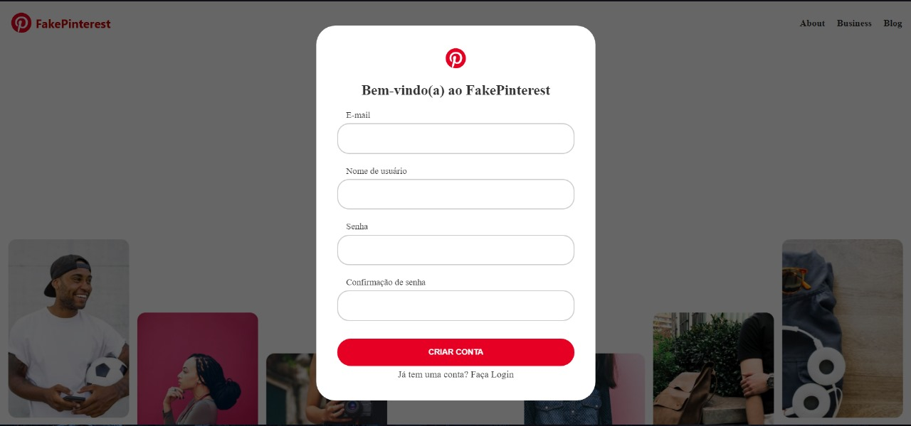
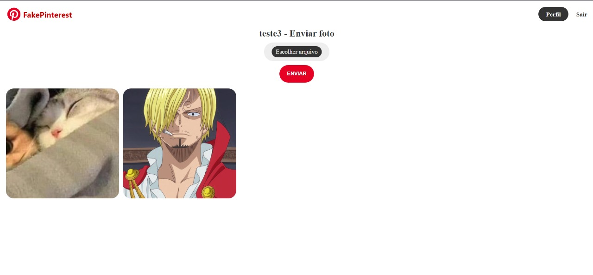
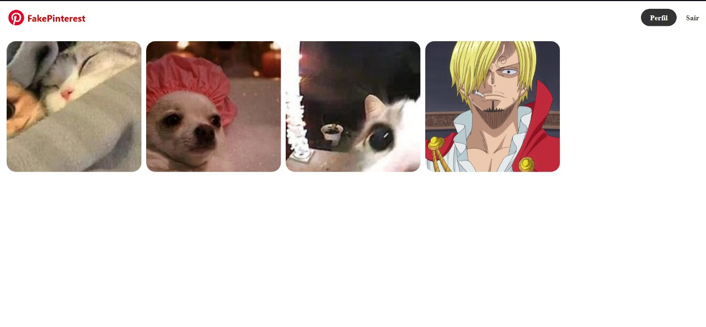

# Projeto Réplica do Pinterest

Esse é meu primeiro projeto feito com Python usando o Framework Flask.

Esse projeto recria uma versão da página do Pinterest, a qual permite adicionar imagens e compartilhar imagens de outros usuários.

O projeto foi criado utilizando-se da linguagem Python, com o uso do framework Flask. Como o site envolve um sistema de criação de conta, o primeiro passo foi a criação de um banco de dados em SQLite, vinculado ao código por meio do SQLAlchemy. Além disso, para garantir a segurança do sistema, também foi usada a extensão Flask-Bcrypt para criptografia das senhas dos usuários.

Essas são as rotas do site:

### *homepage:*

Nela é feito o processo de login e também permite direcionamento à rota de Criar Conta;

### *criar_conta:*

Permite a criação de uma nova conta, com sistema de checagem de senhas e de repetição de e-mail;

### *perfil:*

Essa rota conta com a variável de id que permite a visualização do perfil de um usuário específico.

Assim que a conta é criada ou o login é realizado, o usuário já é direcionado ao seu próprio perfil.

Ele pode checar outros perfis pelas imagens do feed e também clicando nas imagens que ele compartilhou de outras contas.

Para retornar a seu próprio perfil, basta ele clicar em "Perfil" na barra de navegação no topo da página;

### *logout:*

Na barra de navegação é sempre possível que o usuário clique em "Sair" para realizar o logout;

### *feed:*

Ao clicar na logo FakePinterest, a página é direcionada ao "Feed", onde as imagens compartilhadas pelo usuário atual e por demais usuários podem ser visualizadas.

Aqui, as imagens aparecerão quando forem adicionadas originalmente e sempre que forem compartilhadas por outros perfis.

Ao clicar em qualquer imagem no feed, o usuário será direcionado a uma página que lhe dará duas opções: ver o perfil que a compartilhou ou fazer a adição da imagem em seu próprio perfil.

### *Adicionar:*

Permite o usuário adicionar ao próprio perfil qualquer foto já postada. É o compartilhamento.

### *Banco de Dados:*

Para administrar o site, foram criadas três tabelas no banco de dados: Usuario e Posts

Em Usuario, estão os dados de todos os usuários da plataforma.

Em Posts, estão os dados de todas as imagens adicionadas como o id do usuário que a postou e sua data de criação.

Para o visual da página, foi utilizado CSS e HTML.

*Observação:* este projeto foi feito acompanhando o curso Python Impressionador da Hashtag Treinamentos.